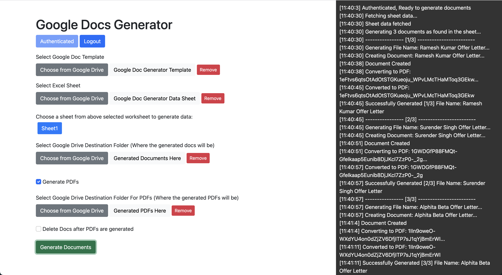

# Google Doc Generator: Your Automated Document Creator

Live Here: [https://imlolman.github.io/google-docs-generator/](https://imlolman.github.io/google-docs-generator/)

## Introduction

Google Doc Generator is a web-based tool designed to automate the creation of Google Documents based on predefined templates and data from Excel sheets. With a user-friendly interface, seamless Google Drive integration, and additional PDF generation capabilities, Google Doc Generator streamlines the process of generating customized documents, saving you time and minimizing the risk of human error.

## Open Source

Yes, you read that right! Google Doc Generator is an open-source project, and we welcome contributions from everyone. Feel the magic of community-driven development.

## Features

-   **Zero Server-Side Operations**: Pure web-based technology ensures your tokens are stored in local storage. Your data never leaves your browser!
-   **Google Account Authentication**: Log in securely with your Google account to browse your Google Drive files like you're simply extending your workspace.

-   **Template Selection**: Pick your template, and let the magic begin. Convert your Google Docs into customized outputs effortlessly.

-   **Excel Sheet Import**: One Excel sheet, endless possibilities. Populate your chosen template with row-by-row customization based on your data.

-   **Destination Folder**: You pick where your masterpiece ends up. Select a Google Drive folder and make organization a breeze.

-   **Generate PDF**: Transform your Google Doc into a polished PDF, all at the click of a button.

-   **Save PDF to Folder**: You decide where your PDFs belong. Choose your folder and save directly.

-   **Delete Doc After PDF Generation**: Keep your space clutter-free. Optionally, delete the Google Doc once your PDF is generated.

-   **Activity Logs**: Keep an eye on what's happening. Monitor operations and troubleshoot easily with logs displayed on the side.

## How to Use

1. **Authenticate**: Click the 'Authenticate' button to securely log in to your Google account.

2. **Select Template**: Choose a Google Document template to serve as your base. Ensure your template uses variable placeholders in the format of `{{variable name}}`. For example, you can see our [Sample Template](https://docs.google.com/document/d/1nBHaNBWrudTFliQExdY2SDz1dEJwELerEP8GgBmkgC4/edit?usp=sharing).

3. **Import Data**: Import an Excel sheet that will be used for populating the template. The first row should contain the variable names that match the `variable name` format used in the template. Starting from the second row, new documents will be generated. The first column should be used for filenames. For reference, check our [Sample Excel Sheet](https://docs.google.com/spreadsheets/d/1wmMLXyhaQ-va0ms6AeNjD6imh2ILDgRUW7DcpmpNUBg/edit?usp=share_link).

4. **Choose Destination**: Specify a Google Drive folder where your newly minted documents will be stored.

5. **Additional Options**:

    - Choose to generate the document as a PDF.
    - Specify a different folder to save the PDFs.
    - Opt to delete the original Google Document after the PDF has been generated.

6. **Generate**: Click the 'Generate' button to begin the automatic document creation process.

7. **View Logs**: Monitor the activity logs on the left-hand side of the interface for real-time updates and troubleshooting.

8. **Sample**: Here's a sample of what you can do with Google Doc Generator. This folder contains a sample template, sample data sheet, sample generated docs, sample pdfs aswell. [Open Sample Folder](https://drive.google.com/drive/folders/1z8IckHReKyh9bPSQU0hQ7NkR9Zf-z75f?usp=sharing)

## Requirements

-   A Google Account
-   A web browser that supports the modern web

## Installation

Not needed! Dive right in—it's all web-based.

## Use Your Own Google API Credentials Steps

-   Visit [Google Cloud Console](https://console.cloud.google.com/apis/credentials)
-   Create an API Key
-   Create an OAuth Client ID (Web Application)
-   Enable Below APIs
    -   Google Drive API
    -   Google Docs API
    -   Google Sheets API
    -   Google Picker API
-   Replace the api key and client id in the `index.html` file

## License

Freedom of use, powered by the MIT License. See the [LICENSE.md](LICENSE.md) for full details.

## Privacy Policy

Google Doc Generator takes your privacy seriously. Though the application performs zero server-side operations and your tokens are stored in local storage, you should be aware that you are authenticating with your Google account and browsing your Google Drive files. Your data never leaves your browser, and we do not collect, store, or transmit any of your personal information. By using this tool, you agree to allow the application to interact with your Google Drive, Google Docs, and Google Sheets for the sole purpose of automating document creation based on the data you provide. For more information, please review our full Privacy Policy.

## Terms of Service

By using Google Doc Generator, you agree to abide by the following terms of service. This tool is provided "as is" and the developers make no warranties, either express or implied, regarding its functionality or reliability. While we strive to keep the tool updated and error-free, we cannot guarantee uninterrupted service. You are solely responsible for the data you input into Google Doc Generator and any documents you generate using it. Any misuse of the tool or violation of these terms can result in termination of your access to the service.

## Contributing

Open to all, open for all. Feel free to contribute to this ground-breaking project. Major change in mind? Open an issue first to discuss.
